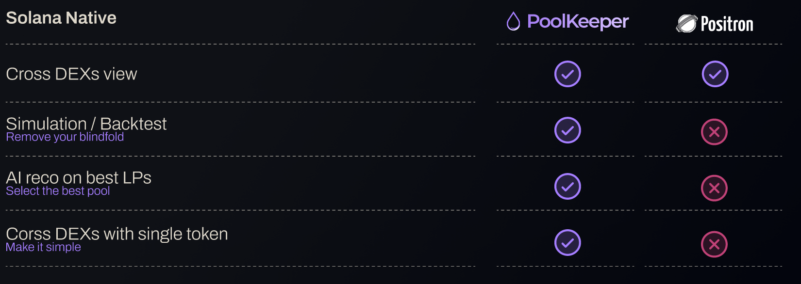

# Poolkeeper

**Poolkeeper** is a non-custodial Solana-native control panel that lets users track historical APRs, get AI-driven yield insights, and rebalance liquidity pools across DEXs in one click.

⚠️ If you are familiar with [Positron](https://www.pos.fi), be aware that we are building a much better solution.

---

## ⚙️ Features

- Simulate liquidity-pool performance over time (returns, fees, token price movements)  
- Model multiple pool strategies and parameters  
- Front-end UI built with Vue (`./frontend/`), Rust and TypeScript (`./scripts/` and `./supabase/`) for smart contracts and deployment script
- Includes vault management logic (in `./programs/vault_manager/`) for LP strategies
- Scripts and test suites to validate the simulation logic (`./scripts/`, `./tests/`) 
- Integration with a Supabase backend (in `./supabase/`) for storing snapshots of blockchain state

---

##  Colosseum Hackathon Details

We are still building on this project even post-submission.

Here is how the code base looked like when we submitted it:

Commit hash - [bd6d1e6
](https://github.com/matterattetatte/poolkeeper/tree/bd6d1e61b9ee3c17c1ce24ff2cb19ccda8e60bb7)

